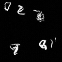
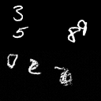
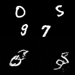

<div align="center">

# Nano-Sora

### A Minimal Diffusion Transformer for Video Generation

[](https://www.python.org/downloads/)
[](https://pytorch.org/)
[](https://opensource.org/licenses/MIT)

*Research-grade implementation of **Sora-style architecture** (3D Patches + DiT) trained with **Rectified Flow***

[Features](#-features) • [Demo](#-demo) • [Quick Start](#-quick-start) • [Architecture](#-architecture) • [Training](#-training)

</div>

---

## Demo

### Generated Video Samples

<div align="center">



*Videos generated from pure noise using Rectified Flow sampling (200 steps)*

</div>

### Generation vs Ground Truth Comparison

<div align="center">

| Sample 1 | Sample 2 | Sample 3 |
|:--------:|:--------:|:--------:|
|  |  |  |

*Top: Ground Truth • Bottom: Generated — The model learns to capture digit motion dynamics*

</div>

---

## Features

- **3D Spacetime Patches (Tubelets)** — Unlike 2D+Temporal attention, we treat video as a 4D manifold, enabling the model to learn joint spacetime physics naturally
- **Rectified Flow** — ODE-based training objective (`L = ||v - (x₁ - x₀)||²`) for straighter generation trajectories and 10x faster sampling
- **Flash Attention** — Memory-efficient O(N) attention using PyTorch 2.0's `scaled_dot_product_attention`
- **AdaLN-Zero Conditioning** — Adaptive Layer Normalization with zero-initialization for stable training
- **EMA Weights** — Exponential Moving Average for smoother, higher-quality generations
- **Mixed Precision (AMP)** — Automatic mixed precision training for 2x speedup on modern GPUs

---

## Quick Start

### Installation

```bash
# Clone the repository
git clone https://github.com/yourusername/Nano-Sora.git
cd Nano-Sora

# Install dependencies
make install
```

### Training

```bash
# Train with default config (downloads Moving MNIST automatically)
make train

# Train with custom batch size
make train-small  # batch_size=16

# Quick debug run
make train-debug  # 2 epochs, batch_size=8
```

### Inference

```bash
# Generate samples from trained model
make inference

# Use Heun sampler for better quality
make inference-heun

# Custom checkpoint
make inference CKPT=path/to/checkpoint.pt
```

---

## Architecture

```
┌─────────────────────────────────────────────────────────────────┐
│                         Nano-Sora                               │
├─────────────────────────────────────────────────────────────────┤
│                                                                 │
│   Video Input (B, 1, 16, 64, 64)                               │
│          │                                                      │
│          ▼                                                      │
│   ┌─────────────────┐                                          │
│   │  PatchEmbed3D   │  Conv3D with kernel=(2,8,8)              │
│   │   (Tubelets)    │  → 512 spacetime tokens                  │
│   └────────┬────────┘                                          │
│            │                                                    │
│            ▼                                                    │
│   ┌─────────────────┐     ┌─────────────────┐                  │
│   │  + Positional   │ ←── │ Sinusoidal Time │                  │
│   │    Embedding    │     │    Embedding    │                  │
│   └────────┬────────┘     └─────────────────┘                  │
│            │                                                    │
│            ▼                                                    │
│   ┌─────────────────┐                                          │
│   │   DiT Block x8  │  AdaLN-Zero + Flash Attention + MLP      │
│   └────────┬────────┘                                          │
│            │                                                    │
│            ▼                                                    │
│   ┌─────────────────┐                                          │
│   │  Final Linear   │  Project back to patch dimension         │
│   └────────┬────────┘                                          │
│            │                                                    │
│            ▼                                                    │
│   Velocity Field (B, 1, 16, 64, 64)                            │
│                                                                 │
└─────────────────────────────────────────────────────────────────┘
```

### Key Design Choices

| Component | Choice | Rationale |
|-----------|--------|-----------|
| Tokenizer | 3D Conv (2,8,8) | 512 tokens for 16×64×64 video |
| Attention | Flash Attention | O(N) memory, enables fine patches |
| Conditioning | AdaLN-Zero | Stable training, zero-init gates |
| Training | Rectified Flow | Straight trajectories, fast sampling |
| Sampling | Euler/Heun ODE | 50 steps (vs 1000 for DDPM) |

---

## Training Details

### Default Configuration

| Parameter | Value | Description |
|-----------|-------|-------------|
| `hidden_size` | 384 | Transformer hidden dimension |
| `depth` | 8 | Number of DiT blocks |
| `num_heads` | 6 | Attention heads |
| `patch_size` | (2, 8, 8) | Spacetime patch dimensions |
| `batch_size` | 64 | Training batch size |
| `epochs` | 100 | Training epochs |
| `lr` | 3e-4 | Learning rate (AdamW) |
| `flow_steps` | 50 | ODE sampling steps |

### GPU Configurations

```bash
# T4 (16GB) - Conservative
python scripts/train.py --config configs/t4_quality.yaml

# L4 (24GB) - Balanced
python scripts/train.py --config configs/l4_high_quality.yaml

# A100 (40GB+) - Best Quality
python scripts/train.py --config configs/a100_best_quality.yaml
```

### Training Metrics

- **Loss**: Velocity Field MSE on test set
- **Visualization**: Spacetime attention maps (temporal consistency verification)

---

## Project Structure

```
Nano-Sora/
├── configs/
│   ├── default.yaml          # Default training config
│   ├── t4_quality.yaml       # T4 GPU optimized
│   ├── l4_high_quality.yaml  # L4 GPU optimized
│   └── a100_best_quality.yaml# A100 GPU optimized
├── src/
│   ├── model.py              # NanoSora model architecture
│   ├── trainer.py            # Training loop with Rectified Flow
│   ├── dataset.py            # Moving MNIST data loading
│   ├── config_parser.py      # Configuration management
│   └── utils.py              # Utilities and helpers
├── scripts/
│   ├── train.py              # Training entry point
│   └── inference.py          # Generation entry point
├── tests/
│   └── test_model.py         # Unit tests
├── Makefile                  # Convenience commands
├── requirements.txt          # Dependencies
└── README.md
```

---

## Requirements

- Python 3.8+
- PyTorch 2.1+ (for Flash Attention)
- CUDA 11.8+ (recommended)

```
numpy<2.0.0
torch>=2.1.0
torchvision
pyyaml
tqdm
matplotlib
requests
```

---

## Acknowledgments

This implementation is inspired by:

- [Sora](https://openai.com/sora) — OpenAI's video generation model
- [DiT](https://github.com/facebookresearch/DiT) — Scalable Diffusion Models with Transformers
- [Rectified Flow](https://arxiv.org/abs/2209.03003) — Flow Straight and Fast

---

## License

MIT License - feel free to use this for research and educational purposes.
